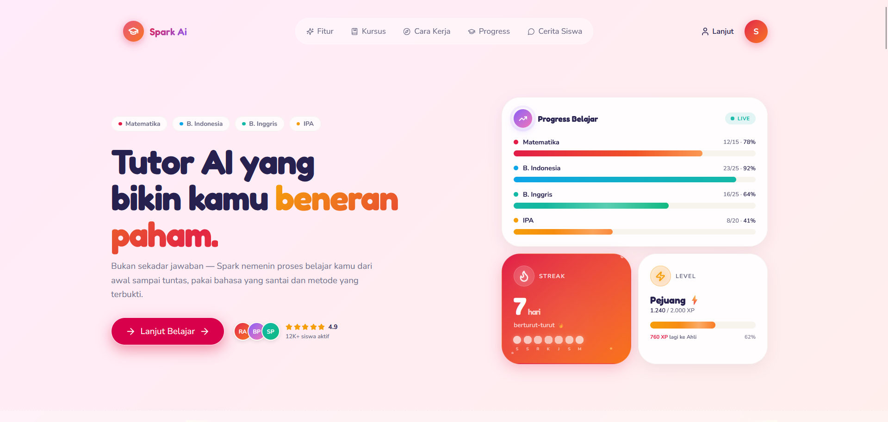

# ✨ Spark AI
### *Asisten Tutor Adaptif & Edukasi Personal Berbasis Kecerdasan Buatan untuk SMA/SMK Indonesia*



Pendidikan berkualitas adalah hak setiap anak. Namun pada kenyataannya, pembelajaran di kelas seringkali bersifat satu-ukuran-untuk-semua (*one-size-fits-all*). Di rumah, banyak siswa yang tidak mendapatkan pendampingan belajar karena orang tua sibuk bekerja atau kurang menguasai materi. 

**Spark AI** hadir sebagai jembatan pembatas kesenjangan tersebut. Kami membangun sebuah asisten tutor berbasis AI yang **sabar, interaktif, personal, dan menyenangkan**. Aplikasi ini secara adaptif menyesuaikan gaya penyampaian materi, tingkat kesulitan soal, serta struktur tantangan harian agar pas dengan keunikan kognitif masing-masing siswa SMA & SMK di Indonesia.

---

## 🎯 Pilar Utama & Fitur Unggulan

### 1. Personalisasi Gaya Belajar Adaptif (`learningStyle`)
Setiap siswa memiliki profil belajar unik yang terdeteksi saat *onboarding* atau dapat disesuaikan pada laman Profil. Spark AI mendukung 4 gaya belajar utama:
*   **Tipe Visual** 📊
    *   **Fitur**: Menyertakan visualisasi konsep berupa peta konsep dan diagram alir menggunakan sintaks **Mermaid.js** (misal: `graph TD`).
    *   **Metode**: Menggunakan kekuatan analogi visual dan deskripsi imajinatif untuk mempermudah pemetaan konsep-konsep abstrak.
*   **Tipe Kasus & Praktek (Example-Heavy)** 📝
    *   **Fitur**: Teori minimalis di awal yang langsung dihubungkan ke **Studi Kasus nyata** atau contoh soal konkret.
    *   **Metode**: Pembahasan solusi dilakukan secara bertahap (*Step-by-Step Walkthrough*) agar siswa belajar dari contoh aplikasi langsung.
*   **Tipe Dialog Sokratik (Socratic)** 💬
    *   **Fitur**: Penyajian materi dalam bentuk **dialog dua arah** (tanya-jawab) antara karakter "Siswa" dan "Spark".
    *   **Metode**: Alih-alih memberikan jawaban langsung, Spark memandu logika berpikir siswa melalui rangkaian pertanyaan pancingan.
*   **Tipe Tekstual** 📚
    *   **Fitur**: Penjelasan akademis mendalam, formal, terstruktur dengan sub-bab yang jelas.
    *   **Metode**: Dilengkapi dengan daftar glosarium istilah dan referensi teori formal untuk memperkuat basis literasi membaca.

---

### 2. AI Daily Challenge & Dynamic Mix System
Untuk melatih konsistensi belajar harian, Spark AI menyediakan **Tantangan Harian Campuran** yang porsi materinya disesuaikan dengan profil belajar siswa:
*   **Jenis Tantangan Harian**:
    *   **`QUESTION` (Soal Latihan)**: Menguji pemahaman aktif menggunakan bank soal yang terverifikasi (bukan *AI-generated* instan untuk mapel nasional).
    *   **`MATERIAL` (Bahan Bacaan)**: Artikel pembelajaran kontekstual sepanjang 400-800 kata yang dihasilkan secara cerdas oleh AI.
    *   **`REFLECTION` (Refleksi Metakognitif)**: Prompt terbuka yang menuntut siswa mengevaluasi cara belajar mereka sendiri, dianalisis secara otomatis oleh AI (analisis kedalaman, sentimen, dan saran belajar).
*   **Komposisi Komposisi Adaptif (Mix Config)**:
    *   *EXAMPLE_HEAVY*: **5 Soal** + **1 Materi** + **1 Refleksi** (Total: 7 item)
    *   *TEXTUAL*: **2 Soal** + **4 Materi** + **1 Refleksi** (Total: 7 item)
    *   *VISUAL & SOCRATIC*: **3 Soal** + **2 Materi** + **2 Refleksi** (Total: 7 item)
*   **Sistem Generasi Hybrid**:
    *   *Auto-Generated*: 4 tantangan otomatis yang diperbarui setiap hari pada tengah malam.
    *   *On-Demand*: Siswa dapat meminta tantangan tambahan sesuai keinginan (dibatasi 10× per hari untuk menghindari spam).

---

### 3. Sistem Kurikulum Hybrid 3-Lapis
Kurikulum Spark AI dirancang secara hibrida guna menyeimbangkan akurasi akademik nasional dengan fleksibilitas eksplorasi minat siswa:

*   **Lapis 1 — Kurikulum Nasional Terkurasi (*Seeded*)**:
    Mata pelajaran utama (Matematika, Bahasa Indonesia, Bahasa Inggris, IPA/IPS) disusun secara manual oleh tim kurikulum sesuai Alur Tujuan Pembelajaran (ATP) Kurikulum Merdeka untuk menjamin validitas konsep.
*   **Lapis 2 — Adaptive Difficulty Engine**:
    - **Mastery Score**: Diupdate dinamis skala 0.0 - 1.0 menggunakan rumus *Exponential Moving Average* (EMA).
    - **Difficulty Level**: Naik-turunnya level soal (Easy → Medium → Hard → Advanced) dikontrol secara otomatis menggunakan *rolling accuracy* dari 5 attempt terakhir.
    - **Prerequisite Gate**: Sistem memastikan siswa menyelesaikan dan memahami konsep prasyarat sebelum membuka materi lanjutan.
*   **Lapis 3 — Custom Subjects (AI-Generated & Terisolasi)**:
    Siswa bebas memasukkan bidang studi apa saja (misal: *Coding*, *Desain Grafis*, *Bahasa Jawa*, *Bahasa Korea*). AI akan menghasilkan silabus, topik, konsep, serta 5-8 soal pre-test secara instan yang divalidasi ketat lewat skema Zod.

---

### 4. Dokumentasi Belajar Digital (Upload PDF/DOCX)
Siswa dapat mengunggah lembar materi atau soal dalam format PDF/DOCX yang sering dibagikan oleh guru di sekolah. Spark AI akan mengekstrak teks menjadi format Markdown bersih di database, lalu AI memprosesnya untuk:
- Merangkum poin-poin penting materi secara instan.
- Mengubah tugas-tugas dalam dokumen menjadi latihan soal interaktif mode Socratic.

---

### 5. Gamifikasi Etis & Menyenangkan
Menggunakan riset motivasi psikologis untuk memacu semangat belajar tanpa metode yang membuat kecanduan:
*   🔥 **Streak Belajar**: Menghitung hari berturut-turut belajar dengan visualisasi api dan bantuan *Streak Freeze* jika absen satu hari.
*   🌱 **Study Buddy (Teman Tumbuh)**: Hewan atau tanaman virtual (kaktus, bunga, pohon) yang tumbuh subur hanya jika siswa aktif belajar secara konsisten.
*   ⭐ **Bintang Konsep (Knowledge Star)**: Representasi grafis konstelasi bintang di langit malam yang akan menyala seiring dengan konsep-konsep pelajaran yang berhasil dikuasai (*mastered*).
*   🏆 **Kustomisasi Avatar & Badge**: Lebih dari 50 kategori badge yang bisa dikoleksi serta opsi kustomisasi visual karakter Spark menggunakan poin yang diperoleh dari belajar (bukan uang).

> [!IMPORTANT]
> **Anti-Pattern yang Kami Hindari:**
> Spark AI secara etis berkomitmen untuk **TIDAK** menyertakan fitur gacha/loot box, sistem energi yang membatasi belajar, iklan, notifikasi agresif, ataupun leaderboard global yang memicu persaingan tidak sehat (*toxic social comparison*).

---

## 🛠️ Arsitektur Teknologi

- **Frontend**: React 19, Next.js 16 (App Router), TailwindCSS, Framer Motion, Lucide Icons.
- **Backend & Database**: Next.js Server Actions, PostgreSQL, Prisma ORM.
- **Linter & Code Quality**: Biome JS & TypeScript Compiler.
- **AI Integration**: Vercel AI SDK, OpenAI API, Structured JSON Outputs.

---

## 💻 Panduan Menjalankan Project secara Lokal

### Persiapan Awal
1. Pastikan Anda telah menginstal **Bun** (runtime tercepat untuk JS/TS).
2. Gandakan repositori ini ke komputer lokal Anda.

### Langkah Instalasi
1. Pasang seluruh dependensi proyek:
   ```bash
   bun install
   ```
2. Buat berkas konfigurasi lingkungan:
   ```bash
   cp .env.example .env
   ```
   *Sesuaikan url `DATABASE_URL` dengan database PostgreSQL lokal Anda.*

3. Sinkronisasikan database dan jalankan migrasi:
   ```bash
   bun run db:migrate
   bun run db:generate
   ```

4. Masukkan data seeding kurikulum dan user percobaan:
   ```bash
   bun run db:seed
   bun run db:seed:student
   ```

5. Jalankan server lokal:
   ```bash
   bun dev
   ```
   *Buka http://localhost:3000 pada browser Anda.*

---

## 🧪 Pengujian & Penjaminan Kualitas

Selalu jalankan perintah berikut sebelum melakukan integrasi kode baru untuk memastikan stabilitas aplikasi:

- **Verifikasi Tipe Data (TypeScript Compiler)**:
  ```bash
  bun run typecheck
  ```
- **Verifikasi Kualitas Kode & Formatting (Biome)**:
  ```bash
  bun run lint
  ```
- **Melakukan Format Otomatis**:
  ```bash
  bun run format
  ```

---

## 👥 Tim Pengembang — Bismillah Pecah Telor

* **Fiky Alrasya**
* **Hanif Pradipta Ibnu**
* **Muhammad Nurul Abshor**
* **Siam Al Sobari**
