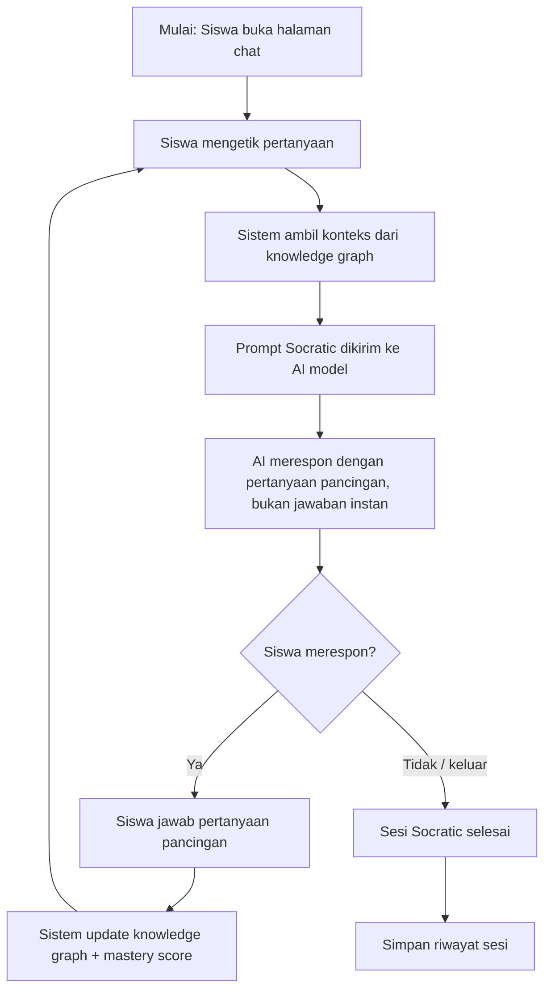

```mermaid
flowchart TD
    A[Mulai: Siswa buka halaman chat] --> B[Siswa mengetik pertanyaan]
    B --> C[Sistem ambil konteks dari knowledge graph]
    C --> D[Prompt Socratic dikirim ke AI model]
    D --> E[AI merespon dengan pertanyaan pancingan, bukan jawaban instan]
    E --> F{Siswa merespon?}
    F -->|Ya| G[Siswa jawab pertanyaan pancingan]
    G --> H[Sistem update knowledge graph + mastery score]
    H --> B
    F -->|Tidak / keluar| I[Sesi Socratic selesai]
    I --> J[Simpan riwayat sesi]
```

Render: buka [mermaid.live](https://mermaid.live) ➜ paste ➜ export PNG
